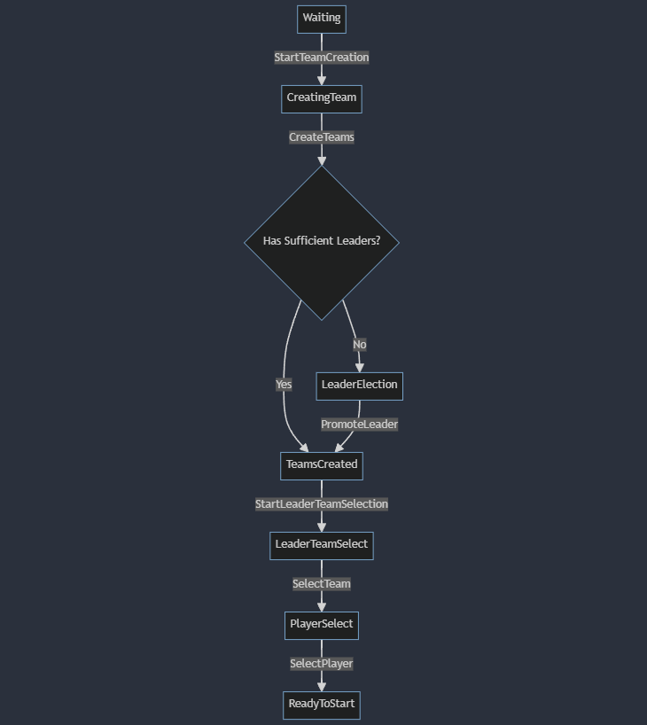

# Lobby Management in Go

Este repositório implementa uma estrutura de `Lobby` para gerenciar jogadores, equipes e líderes em um ambiente de jogo ou aplicação colaborativa.

## Funcionalidades Principais

- **Criação de Lobby:** Crie um novo lobby com um mestre, limite de habilidades técnicas (`HardSkills`) e habilidades sociais (`SoftSkills`).
- **Gestão de Jogadores:** Adicione jogadores e mentores ao lobby, garantindo que eles atendam aos critérios de habilidades.
- **Criação de Equipes:** Organize os jogadores em equipes com base em seus perfis e a disponibilidade de mentores.
- **Eleição de Líderes:** Promova líderes entre os jogadores, com base em habilidades e outros critérios predefinidos.
- **Seleção de Equipes e Jogadores:** Permita que os líderes escolham suas equipes e jogadores, seguindo um sistema de prioridades.

## Estrutura do Código

### Tipos de Dados

- **LobbyStatus:** Define os diferentes estados pelos quais o lobby pode passar.
- **Lobby:** A estrutura principal que mantém todos os detalhes sobre o lobby.
- **ChooseType:** Define os diferentes tipos de seleção que podem ocorrer (por exemplo, promover um líder, selecionar uma equipe, selecionar um jogador).
- **ChooseControl:** Controla o processo de seleção em cada fase.
- **LobbyStatus Constants:**
  - `Waiting`: Lobby aguardando jogadores.
  - `CreatingTeam`: Fase de criação das equipes.
  - `TeamsCreated`: Equipes criadas, aguardando a eleição de líderes.
  - `LeaderElection`: Eleição de líderes em andamento.
  - `LeaderTeamSelect`: Líderes escolhendo suas equipes.
  - `PlayerSelect`: Líderes selecionando jogadores para suas equipes.
  - `ReadyToStart`: Lobby pronto para iniciar o jogo ou atividade.

### Diagrama de status




### Funções Principais

- **NewLobby:** Cria um novo lobby, inicializando todos os parâmetros necessários.
- **Join:** Permite que jogadores ou mentores entrem no lobby, respeitando as regras definidas.
- **StartTeamCreation:** Inicia o processo de criação de equipes.
- **CreateTeams:** Cria equipes e organiza os jogadores e mentores.
- **PromoteLeader:** Promove um jogador ao papel de líder, se ele atender aos critérios.
- **StartLeaderTeamSelection:** Inicia a fase de seleção de equipes pelos líderes.
- **SelectTeam:** Permite que um líder selecione uma equipe específica.
- **SelectPlayer:** Permite que um líder selecione jogadores para sua equipe.
- **DefinePriorities:** Define as prioridades de seleção de jogadores com base em suas habilidades e outros critérios.

### Erros Comuns

- **invalid_status:** Ocorre quando uma ação é tentada fora da ordem correta do fluxo de trabalho do lobby.
- **not_enough_players:** Não há jogadores suficientes para iniciar a criação de equipes.
- **not_enough_mentors:** Não há mentores suficientes para orientar as equipes.
- **profile_has_too_many_skills:** Um jogador possui mais habilidades do que o permitido pelo lobby.
- **profile_is_not_a_leader/master:** Tentativa de um perfil inadequado de executar uma ação restrita a líderes ou mestres.

## Exemplo de Uso

```go
package main

import (
    "fmt"
    "lobby"
    "profile"
)

func main() {
    master := profile.NewProfile("Master", profile.Master)
    lobby := lobby.NewLobby(master, "My Game Lobby", 5, 3)
    
    player1 := profile.NewProfile("Player1", profile.Player)
    lobby.Join(player1)

    lobby.StartTeamCreation()
    lobby.CreateTeams()

    fmt.Println("Lobby Status:", lobby.Status)
}
